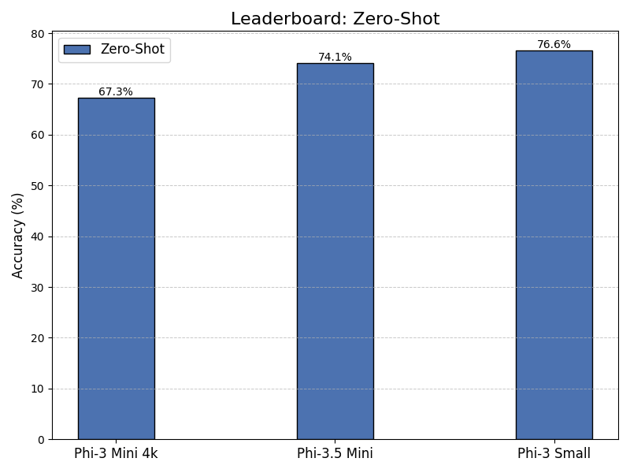
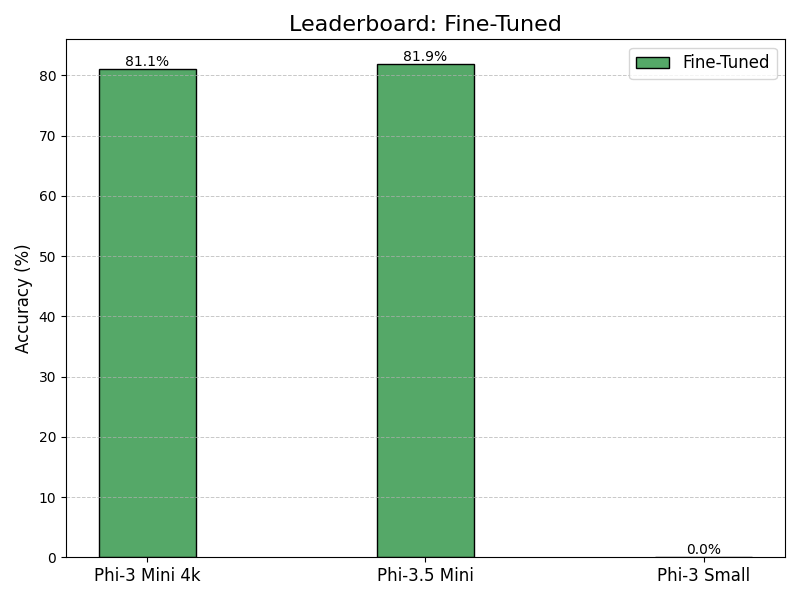

# Natural Language Inference (NLI) Kaggle Competition

This repository contains code and experiments related to the **Contradictory, My Dear Watson** [Kaggle competition](https://www.kaggle.com/competitions/contradictory-my-dear-watson). My main motivation for this project was to play around with my new [RTX 3090 PC build](https://pcpartpicker.com/user/arnePannemans/saved/MgtPzy) and experiment with state-of-the-art (smaller) large language models to see how fine-tuning can improve their performance for the task. A key challenge in this project is working within the 24GB VRAM limit of the RTX 3090, which requires careful model selection and optimization such as quantzation to maximise model performance. 

I divided the data using the following split:
- **Training Set**: 9091 examples (~75%)
- **Validation Set**: 1516 examples (~12.5%)
- **Test Set**: 1516 examples (~12.5%)


## 📖 Background

The **Contradictory, My Dear Watson** competition challenges participants to build a Natural Language Inference (NLI) model capable of determining the relationship between pairs of sentences across 15 different languages. The possible relationships are:

- **Entailment**
- **Neutral**
- **Contradiction**

For more details about the competition, [check out the official page here](https://www.kaggle.com/competitions/contradictory-my-dear-watson).

## 🚀 Project Overview

This project explores various transformer-based models for the NLI task, testing out both out-of-the-box performance and performance after fine-tuning.

## 🧰 Setup Instructions

### Installation

1. **Clone the repository**

    ```bash
    git clone https://github.com/ArnePannemans/Kaggle_NLI.git
    cd Kaggle_NLI
    ```

2. **Create and activate a virtual environment**

    ```bash
    python -m venv venv
    source venv/bin/activate 
    ```

3. **Install the required packages**

    ```bash
    pip install -r requirements.txt
    ```

## 📝 Evaluating a Model

To evaluate a pre-trained model on the NLI task, run the following command:

```bash
cd Kaggle_NLI
python src/evaluate.py --config configs/eval_phi3.yaml
```

This script will load the model specified in the configuration file and evaluate it on the test set

## 🔧 Fine-tuning a Model

To fine-tune a model on the NLI dataset, execute:

**Run finetuning**

```bash
cd Kaggle_NLI
python src/train.py --config configs/train_phi3yaml
```
This will start the fine-tuning process using the settings defined in your configuration file. Adjust the configurations to tweak parameters like learning rate, batch size, and epochs.

## 📝 Experiments and Results

### **Zero-Shot Results** (fp16):

1. **Phi-3 Mini 4k Instruct**: Accuracy: **67.3%**
2. **Phi-3.5 Mini Instruct**: Accuracy: **74.1%**
3. **Phi-3 Small Instruct**: Accuracy: **76.6%**



### **Fine-Tuned Results** (fp16):

1. **Phi-3 Mini 4k Instruct**: Accuracy: **81.1%**
2. **Phi-3.5 Mini Instruct**: Accuracy: **81.9%**



## 📌 Backlog

- **microsoft/Phi-3-medium-4k-instruct** : GGUF quantized to 8 bits (Phi-3-medium-4k-instruct-Q8_0.gguf). Size: 14.83GB. This model offers extremely high quality due to maximum quantization, though it may be more than necessary for our purposes.
- **solar-pro-preview-instruct.Q6_K.gguf**: Currently top model on the open-source LLM leaderboard, quantized in Q6 format. Size: 18.2GB which is perfect for the GPU.